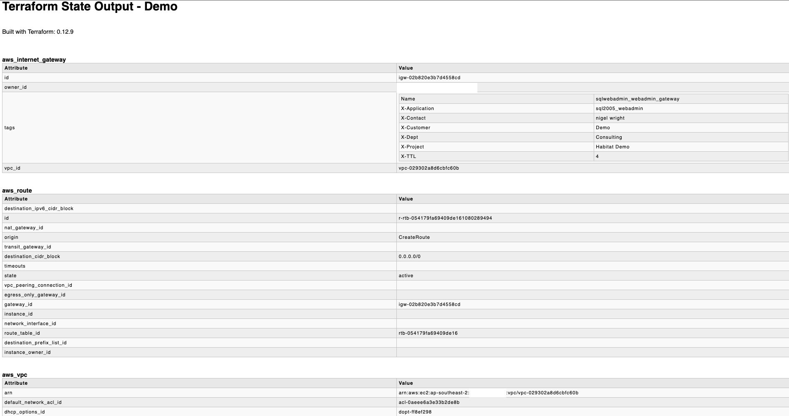

# TFDOC - Quick HTML output of Terraform state file

This is a tool to quickly get the HTML output of the terraform state. 

## Usage

Build:   
`go build -o tfdoc main.go`

```bash
./tfdoc --help                                                                         
Usage of ./tfdoc:
  -name string
        Name of the report (default "Terraform Output")
  -out string
        Path and name of the html file to create (e.g /tmp/myoutput.html) (default "tfdoc.html")
  -tfstate string
        Terraform state file location
```

For example :    
```bash
tfdoc --name "My Infrastructure Plan" --out "/tmp/myplan.html" --tfstate "./terraform.tfstate"
```

Example output:


## TODO
Clean up the html writing and the type check logic

